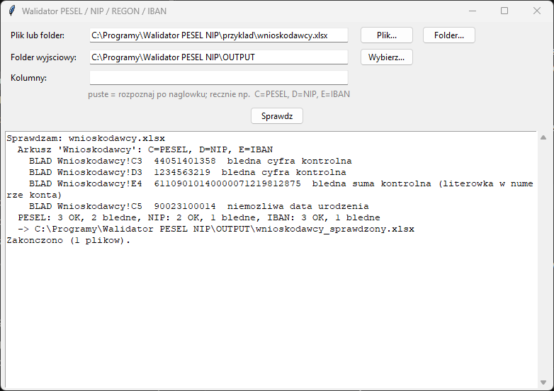

# Walidator PESEL / NIP / REGON / IBAN (Excel)

Program **lokalny** — sprawdza numery w arkuszach Excela na Twoim
komputerze i nigdzie ich nie wysyła. Z internetem łączy się tylko po to,
żeby sprawdzić [aktualizacje](#aktualizacje). Przydaje się przy listach
wnioskodawców, umowach, listach płac, wykazach kontrahentów — wszędzie tam,
gdzie literówka w numerze kończy się zwrotem przelewu albo błędem w systemie.



## Co sprawdza

| Numer | Przykład poprawnego | Co jest sprawdzane |
|-------|---------------------|--------------------|
| PESEL | `44051401359` | 11 cyfr, cyfra kontrolna, czy data urodzenia istnieje (np. nie 31 lutego) |
| NIP | `123-456-32-18`, `PL1234563218` | 10 cyfr, cyfra kontrolna |
| REGON | `123456785`, `12345678512347` | 9 lub 14 cyfr, cyfra kontrolna |
| IBAN (numer konta) | `PL61 1090 1014 0000 0712 1981 2874` | 26 cyfr (z `PL` lub bez), suma kontrolna; konta zagraniczne też |
| Dowód osobisty | `ABA 300000` | 3 litery + 6 cyfr, cyfra kontrolna |

Spacje, myślniki i kropki w numerach nie przeszkadzają. Suma kontrolna
wyłapuje praktycznie każdą literówkę — jedną złą cyfrę albo dwie
zamienione miejscami.

**PESEL zapisany w Excelu jako liczba** traci zero z przodu (osoby
urodzone w latach 2000–2009, np. `02270803624` → `2270803624`). Program
uzupełnia to zero i takiego numeru nie zgłasza jako błędu.

## Co powstaje

Kopia pliku z dopiskiem `_sprawdzony` w folderze wyjściowym. Oryginał
nie jest zmieniany.

- **Błędne komórki** mają czerwone tło i komentarz z powodem błędu,
  np. „PESEL: błędna cyfra kontrolna”. W Excelu można je odfiltrować:
  **Filtr → Filtruj według koloru**.
- **Przy kolumnie PESEL** na końcu arkusza dopisywane są dwie kolumny:
  **data urodzenia** i **płeć** (K/M), odczytane z numeru.
- Log w oknie programu pokazuje adresy pierwszych 20 błędnych komórek
  i podsumowanie, np. `PESEL: 120 OK, 3 bledne`.

## Które kolumny są sprawdzane

- **Automatycznie** — po nagłówku w **pierwszym wierszu**. Kolumna, której
  nagłówek zawiera słowo *PESEL*, *NIP*, *REGON*, *IBAN*, *rachunek*,
  *nr konta* albo *dowód*, jest sprawdzana jako ten rodzaj numeru.
  Sprawdzane są wszystkie arkusze w pliku.
- **Ręcznie** — w polu **Kolumny** wpisz litery kolumn, np.
  `C=PESEL, D=NIP, F=IBAN` (rodzaje: `PESEL`, `NIP`, `REGON`, `IBAN`,
  `Dowod`). Wtedy sprawdzane są tylko te kolumny, we wszystkich arkuszach.

W obu przypadkach **pierwszy wiersz jest traktowany jako nagłówek** i nie
jest sprawdzany. Puste komórki są pomijane.

## Instalacja (jednorazowo)

1. **Python** — pobierz z [python.org](https://www.python.org/downloads/windows/)
   (wersja 3.9 lub nowsza). W instalatorze zaznacz **„Add python.exe to PATH”**.
   Opcja „tcl/tk and IDLE” jest zaznaczona domyślnie i musi taka zostać.
   Uprawnienia administratora nie są potrzebne.
2. **Program** — na stronie [github.com/DawidBochno/Walidator-PESEL-NIP](https://github.com/DawidBochno/Walidator-PESEL-NIP)
   kliknij zielony przycisk **Code → Download ZIP**. Rozpakuj archiwum,
   np. do `C:\Programy\Walidator PESEL NIP`. Nie uruchamiaj programu z wnętrza ZIP-a.
3. Kliknij dwukrotnie **`install.bat`**. Instaluje bibliotekę `openpyxl`
   (potrzebny internet) i uruchamia test. Na końcu pojawia się
   **„selftest OK”**, co znaczy, że wszystko działa.
   Jeśli Windows pokaże „System Windows ochronił ten komputer”, kliknij
   **Więcej informacji → Uruchom mimo to**.
4. Program uruchamia się plikiem **`uruchom.bat`**. Wygodnie jest zrobić
   skrót na pulpicie: prawy przycisk na `uruchom.bat` → **Wyślij do →
   Pulpit (utwórz skrót)**.

## Jak używać

1. Uruchom `uruchom.bat`.
2. **Plik lub folder** — przycisk **Plik…** wskazuje jeden arkusz,
   **Folder…** wszystkie pliki `.xlsx` / `.xlsm` w folderze. Domyślnie jest to `INPUT`.
3. **Folder wyjściowy** — tu trafią sprawdzone kopie (domyślnie `OUTPUT`).
4. **Kolumny** — zostaw puste, jeśli nagłówki kolumn zawierają nazwy
   numerów. W przeciwnym razie wpisz je ręcznie (patrz wyżej).
5. Kliknij **Sprawdz** i otwórz plik `_sprawdzony.xlsx`.

Do wypróbowania: plik [`przyklad/wnioskodawcy.xlsx`](przyklad/) z fikcyjnymi
danymi, w którym są cztery błędne numery.

## Aktualizacje

Po uruchomieniu program sprawdza w tle na GitHubie, czy jest nowa wersja.
Jeśli jest, pyta **„Pobrać i zainstalować teraz?”**. Pobierane są tylko
zmienione pliki programu. Foldery `INPUT`, `OUTPUT`, ustawienia i pliki
w `przyklad/` nie są nadpisywane. Po aktualizacji zamknij i uruchom program ponownie. Jeśli program
o to poprosi, uruchom też raz `install.bat` (zmieniły się biblioteki).

- Do GitHuba trafia tylko zapytanie o listę plików programu, **nigdy
  arkusze ani dane**.
- Bez internetu albo przy blokadzie (np. UTM) program działa normalnie,
  bez żadnego komunikatu.
- **Wyłączenie** (np. gdy programy aktualizuje dział IT): utwórz w folderze
  programu pusty plik o nazwie `NIE_AKTUALIZUJ`.
- Kopię pobraną przez `git clone` aktualizuje się poleceniem `git pull`.

## Ograniczenia

- Poprawna suma kontrolna znaczy, że numer **może** istnieć, a nie że
  istnieje i należy do tej osoby. Program nie łączy się z rejestrami
  (GUS, CEIDG, biała lista VAT).
- Stary format `.xls` nie jest obsługiwany — zapisz plik jako `.xlsx`.
- Komórki z formułami są sprawdzane jako tekst formuły; wklej je wcześniej
  jako wartości.
- Plik otwarty w Excelu można sprawdzać, ale wynik zapisywany jest jako
  osobna kopia.

## Testy

```bash
python walidator.py --selftest
```

Test sprawdza sumy kontrolne wszystkich rodzajów numerów, PESEL
z niemożliwą datą i zapisany jako liczba, odczyt daty urodzenia i płci,
rozpoznawanie kolumn po nagłówku i ręczne, czerwone podświetlenie
i komentarze w pliku wynikowym.
